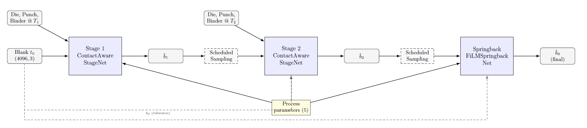
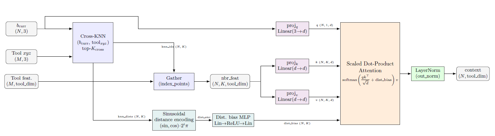
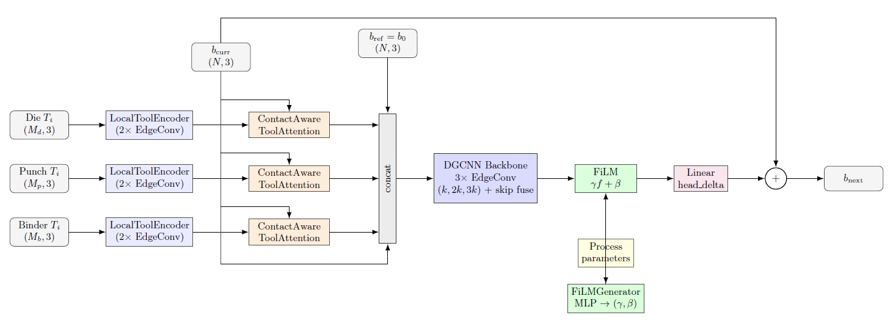
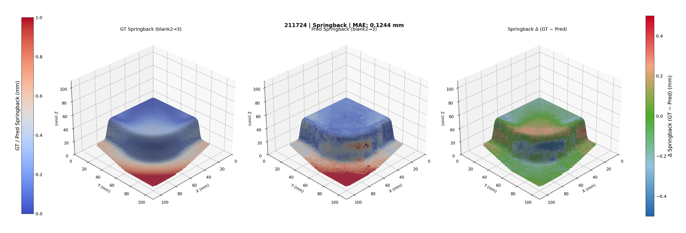
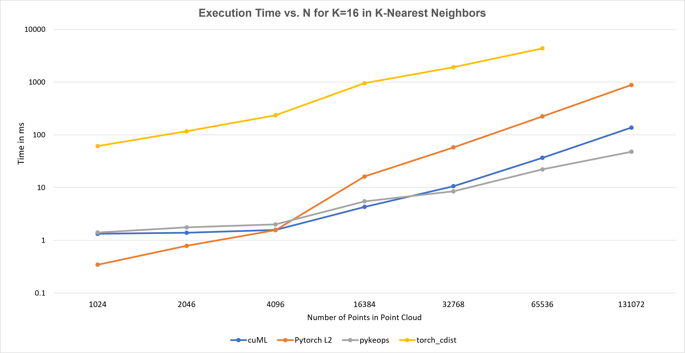
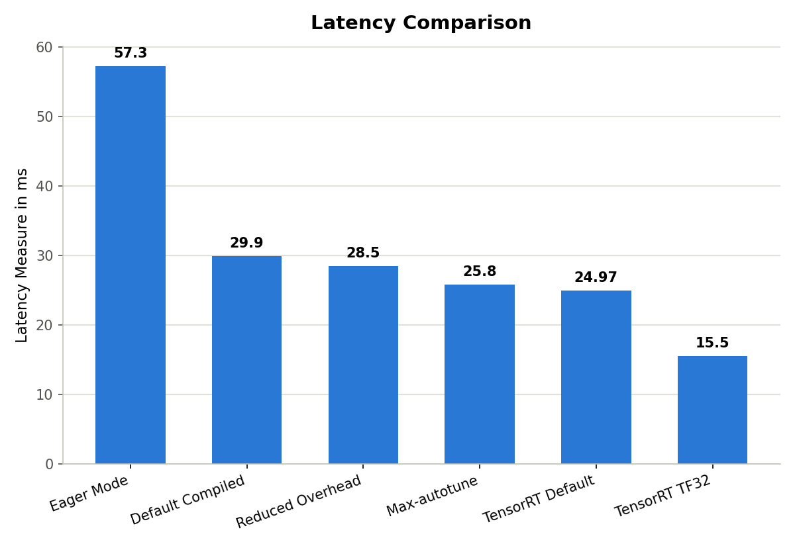
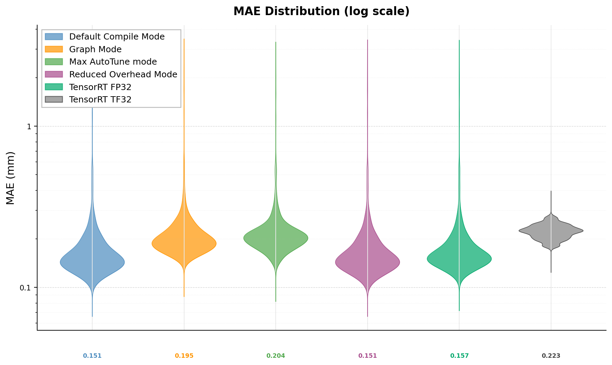

# GPU Accelerated Point Cloud Neural Network for Tool based Springback prediction

**Author:** Raghul Raj Navaneethakrishnan  
**Student ID:** 3703553  
**Thesis Type:** Master Thesis  
**Thesis Number:** MT-3970  
**Supervisor:** Sebastian baum  
**Date:** August 2026  

---

## Abstract

Springback, the elastic
recovery of sheet metal components after the forming tools are removed, causes geometric deviation from the
intended final shape and it is conventionally predicted using finite element method (FEM) simulations. FEM
simulations are accurate but computationally expensive and time-consuming, posing challenges for design
workflows in which multiple tool geometries and process parameters must be evaluated iteratively.

This work explores a data-driven surrogate modeling approach to accelerate springback prediction, learning
a direct mapping from the initial blank and tool geometries at multiple time steps to the resulting springback
shape without requiring an intermediate forming simulation. We implement the surrogate model using a
Dynamic Graph Convolutional Neural Network (DGCNN) backbone, extended with an attention mechanism
relating the blank geometry to each of the three forming tool geometries (die, punch, and binder), enabling
the model to learn the effect of differentiated geometry of each tool on the blank.
The model was developed using PyTorch Lightning, with the k-NN search within the DGCNN EdgeConv
layers, targeting the computational bottleneck identified through systematic profiling with NVIDIA Nsight
tools.

The complete system was trained and evaluated using the DDACS benchmark dataset, a large-scale collection
of FEM simulations of deep-drawn components generated under varying geometric and process conditions.
Experimental evaluation compared inference latency across multiple deployment configurations, namely Py-
Torch eager execution mode, multiple PyTorch compilation modes, and TensorRT-based acceleration, on a
system comprising an Intel(R) Xeon(R) W-2275 CPU @ 3.30GHz and an NVIDIA RTX 3090 GPU with 24
GB VRAM. 

The results showed that the mean inference latency of the accelerated model is reduced from 57.3
milliseconds per sample in eager mode to 15.5 milliseconds per sample.
These findings demonstrate that data driven surrogate model can predict springback directly, and that
combining with custom GPU kernels and Model compilation techniques provides a functional framework for
rapid, iteration-capable springback prediction in metal forming design workflows.

---

## Introduction

Two problems remain open for point cloud based surrogate modeling of springback in deep drawing. The first concerns input representation and generalization. Existing work predicts springback from an already formed intermediate geometry rather than from the initial blank sheet and tool trajectory, and its evaluation is restricted to specific geometries. The authors describe generalization beyond this geometry as an open direction for the future work. Since a neural surrogate approximates the function implicit in its training data, this geometry evaluation leaves open how the model behaves under process parameters or part geometries outside that training distribution.

The second problem is computational. Point cloud architectures construct local graph neighborhoods through nearest-neighbor search at every layer, and this consumes a considerable share of inference time. Inference times on the order of seconds per sample are difficult to accommodate in workflows such as process parameter optimization, which may require hundreds or thousands of forward evaluations to explore a design space. Reducing this cost first requires locating where computation actually concentrates, since memory-bound data movement, the algorithmic complexity of the neighbor search itself, and GPU kernel-launch overhead each call for a different remedy.

### Research Questions

1. Most methods predict springback from the already-formed geometry, requiring the forming process to be simulated or executed before springback can be estimated.
2. Point cloud architectures construct local graph neighborhoods through
nearest-neighbor search at every layer, and this consumes a considerable share of inference time

### Contributions

- Developed a DGCNN based architecture with a cross-attention mechanism between the blank and the
tool geometries (die, punch, binder), predicting the post-springback blank geometry from the blank
sheet at t=0, the tool states across the subsequent time steps, and the governing process parameters,
avoiding the intermediate geometry required during prediction.
- Trained model is profiled on an NVIDIA RTX 3090 GPU, using NVIDIA Nsight Systems and
Nsight Compute for end-to-end and kernel-level analysis and the PyTorch Profiler for the custom kernel
specifically, to distinguish memory-bound, algorithmic, and GPU kernel-launch-bound contributions
to inference latency.
- Bottlenecks identified through profiling using Morton-order spatial sorting, a custom
Triton kernel for windowed k-nearest-neighbor search, and a staged compilation pipeline combining
torch.compile with NVIDIA TensorRT, and quantifies the latency reduction contributed by each
stage.

---

## Methods

### Model Architecture

The model works in four steps. First, each forming tool (die, punch, binder) is encoded by its own dedicated
encoder. Second, the encoded tool geometry is related to the blank through a contact-aware mechanism.
For every blank point, the nearest points on a given tool are located. The distance between the blank point
and each tool point is converted into a learned signal. An attention mechanism then combines this distance
signal with the encoded tool geometry to decide how strongly each nearby tool point should influence that
blank point. Third, the tool-aware description of the blank, together with the blank’s own coordinates, is
passed through a graph-based backbone. The backbone refines the shape prediction by repeatedly looking
at each point’s local neighborhood. It is conditioned on the process parameters through Feature-wise Linear
Modulation (FiLM). Tool encoding, attention, and backbone refinement together form one forming stage,
and this sequence runs twice, once for each of the two forming stages. Fourth, once the two forming stages
have produced a formed shape, a separate network combines this shape with the original undeformed blank.
It applies FiLM conditioning again to predict how the part springs back once the tools are removed.


*Model Training Pipeline*


*Contact-Aware Tool Attention*


*Overview of 1 complete stage*

### Optimizations applied

- Morton-order spatial sorting  to improve memory locality ahead of neighbor search.
- A custom windowed Triton KNN kernel replacing the many small, launch-bound aten::topk-backed kernels identified above with a single fused, register-tiled kernel.
- Model compilation to fuse multiple kernels and operators, reducing the launch-count-driven CPU overhead documented in this section.


### Training Setup

Model training and evaluation were carried out on a workstation equipped with an Intel(R) Xeon(R) W-2275 CPU operating at 3.30 GHz, paired with 128GB of RAM and 24GB NVIDIA GeForce RTX 3090 GPU. The system had NVIDIA driver version 595.71.05, supporting CUDA up to version 13.2 at the driver level. The PyTorch 2.12.0, built with its own bundled CUDA 13.0 runtime (cu130), cuDNN version 92000 and NVCC 11.5. Triton 3.7.0 was used for kernel compilation and execution acceleration where applicable. All code was executed under Python >3.12.3.

BatchSize of 4. complete configuration is mentioned in the configs directory

---

## Results

### Quantitative Results

| Dataset | MSE | RMSE | MAE |
|---------|-----|------|-----|
| DDACS   |  4.835 x 10e-6   |   2.092 x 10e-3   | 1.587 x 10e-3    |    

### Qualitative Analysis


*Ground Truth (GT) and predicted springback comparison with error visualization for Simulation
112282 with RAD = 40 mm and Rectangular Geometry*



*The execution time of the K-NN algorithm for varying point cloud sizes N at a fixed K = 16 i. As N increases, the execution time grows quadratically for torch cdist*


**Table:** Triton KNN Kernel latency (ms) as a function of `HALF_W`, at fixed `TILE_T` = 32. Blank cells (`---`) represent recall less than 94%.

| $N$ | `HALF_W` = 512 | `HALF_W` = 1024 | `HALF_W` = 2048 |
| :--- | :---: | :---: | :---: |
| 4,096 | 1.17 ms | 1.24 ms | 2.21 ms |
| 16,384 | 1.70 ms | 3.00 ms | 5.65 ms |
| 32,768 | --- | 5.47 ms | 10.44 ms |
| 65,536 | --- | 10.38 ms | 20.23 ms |
| 1,000,000 | --- | 158.79 ms | 310.89 ms |

### Latency Comparison

*The mean inference time across different optimisation stages*

### Accuracy Comparison

*The mean MAE comparison across different optimisation stages*

---

## Conclusion

The DGCNN + Attention Model developed has acheived MAE of 0.150mm and the predictions are close to GT. Inference latency of the model is reduced from 57.3 ms (mean) to 15.5ms using the optimization implemented. 

### Future Work

- Implenting Physics Informed Neural networks for Springback prediction. 
- Custom GPU kernels to handle higher resolution Point clouds
- Custom Compiler passes for complex kernels.

---

## Repository Structure

```
├── src/models/          # Model implementations
├── configs/model/       # Model configurations
├── notebooks/           # Analysis notebooks
├── experiments/         # Training outputs
└── docs/                # Documentation
```

---

## Getting Started

```bash
./sandbox.sh start && ./sandbox.sh shell   # your personal GPU container
```

See [SANDBOX.md](SANDBOX.md) for the sandbox. The full documentation lives
under `docs/` - read it in your browser with:

```bash
uv run make -C docs livehtml    # serves on port 7000
```

then open http://localhost:7000 (VS Code forwards the port automatically;
otherwise `ssh -L 7000:localhost:7000 <you>@<server>`). One-shot build:
`uv run make -C docs html` → `docs/_build/html/index.html`.

When you are done with the [Getting Started](docs/source/guides/getting_started.md)
guide, send your supervisor the run ID of your `fast_debug` training.

---

## References

[List key references]
