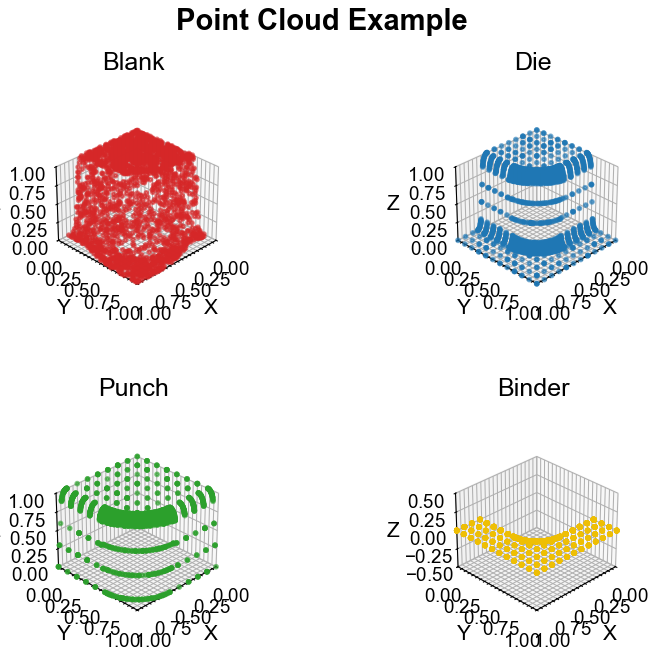
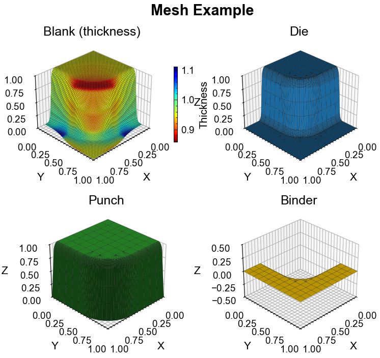

# Plotting

## Built-in Visualization

The template provides point cloud and mesh visualization in `src/visualization/`.

**Point Cloud:**



```bash
uv run python -m src.visualization.pointcloud
```

**Mesh (with thickness):**



```bash
uv run python -m src.visualization.mesh
```

Both functions expect a dict with keys `blank`, `die`, `punch`, `binder` containing PyG Data objects.

```python
from src.visualization import plot_pointclouds, plot_meshes

plot_pointclouds(sample, title="My Sample", save_path="pointcloud.png", show=False)
plot_meshes(sample, title="My Sample", save_path="mesh.png", show=False)
```

:::{note}
The built-in visualization works with the legacy pointcloud format. Visualization for the new multi-timestep pointcloud format is not yet implemented.
:::

## Figure Sizes for Thesis

Thesis documents use DIN A4 single-column (~160mm text width).

| Name | Size | Use case |
|------|------|----------|
| `full` | 6.3" x 2.1" | Standard full-width figure |
| `half` | 3.0" x 2.1" | Two figures side-by-side |
| `grid_2x2` | 6.3" x 5.0" | 2x2 subplot grid |

```python
from src.visualization import setup_plot_for_thesis, SIZES

setup_plot_for_thesis()
fig, ax = plt.subplots(figsize=SIZES["thesis"]["full"])
```

## Figure Sizes for Papers (IEEE)

IEEE two-column layout (~88mm column width).

| Name | Size | Use case |
|------|------|----------|
| `single_col` | 3.5" x 2.5" | Single column |
| `double_col` | 7.16" x 2.5" | Spans both columns |
| `grid_2x2` | 7.16" x 5.0" | 2x2 grid, both columns |

```python
from src.visualization import setup_plot_for_paper, SIZES

setup_plot_for_paper()
fig, ax = plt.subplots(figsize=SIZES["paper"]["single_col"])
```

## File Naming

```
<descriptive_name>_<size>.<svg|png>
```

Examples: `loss_curves_full.png`, `accuracy_single_col.svg`

All sizes and styles are defined in [`src/visualization/config.py`](../../../src/visualization/config.py).
